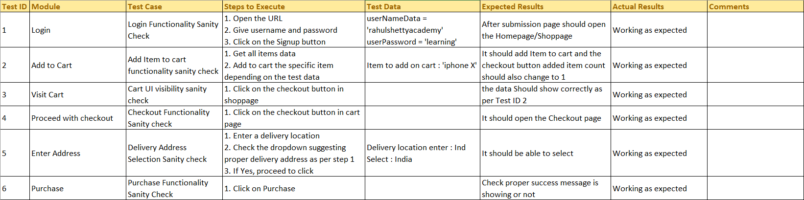

# Protocommerce E2E Testing with Selenium  

## Overview  
Protocommerce is a sample eCommerce website. This project implements an **end-to-end (E2E) test framework** using **Selenium with Python**, applying **Object-Oriented Programming (OOP) principles** for better modularity and maintainability.  

## Features  
✅ E2E test case automation using Selenium  
✅ Python-based framework with OOP design  
✅ Page Object Model (POM) implementation  
✅ Easy-to-extend and scalable structure  

## Test Cases Overview  

  

## Getting Started  
1. Clone the repository  
2. Install dependencies:  
   ```sh
   pip install selenium
3. Run the test:
   ```sh
   cd tests/
   pytest test_e2e.py